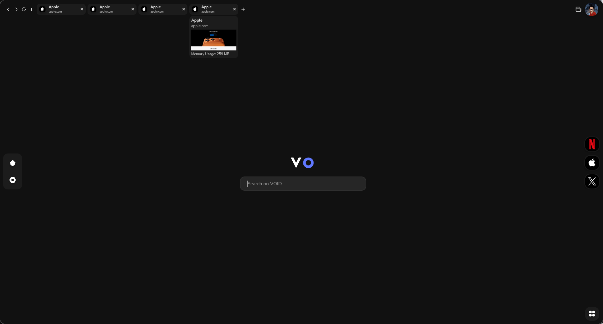

# Void Browser



Void Browser is a modern, lightweight web browser built with Qt6 and C++20. It features a sleek dark theme interface with a focus on simplicity and user experience.

## Features

- **Modern Dark Theme**: Clean, minimalist interface with carefully designed dark color scheme
- **Tab Management**: Easy-to-use tab system with visual indicators
- **Customizable UI**: Modular widget system for easy customization
- **SVG Icons**: Scalable vector icons for crisp display at any resolution
- **Web Integration**: Support for web content display
- **Cross-Platform**: Built with Qt6 for cross-platform compatibility

## Screenshots

The application features:
- Navigation bar with tab management controls
- Left sidebar with home and settings options
- Right sidebar with quick access to web applications
- Central browser area with search functionality
- Modern typography using custom fonts (Nunito and Nano)

## Technical Details

### Architecture
- **Framework**: Qt6 with C++20
- **UI System**: Custom widget hierarchy with theme support
- **Build System**: QMake with Makefile generation
- **Resource Management**: Qt Resource System for assets

### Core Components
- `Widget`: Base widget class with hover and click event handling
- `Nav`: Navigation bar with tab management
- `LeftSideBar`: Navigation sidebar with home and settings
- `RightSideBar`: Quick access sidebar for web applications
- `Theme`: Centralized theme management system
- `Image`: Custom image widget with border radius support
- `SvgWidget`: SVG rendering widget with color customization

### Theme System
The application uses a centralized theme system with the following color palette:
- Background: `#111111`
- Tab background: `#262626`
- Surface: `#1c1c1c`
- Primary color: `#2b0099ff`
- Text: `#ffffff`
- Text hover: `#c1c1c1`

## Requirements

- **Qt6**: Qt6 framework with widgets, SVG, network, and concurrent modules
- **C++ Compiler**: C++20 compatible compiler (GCC, Clang, or MSVC)
- **CMake/QMake**: Build system support
- **Operating System**: Linux, Windows, or macOS

## Installation

### Prerequisites
Make sure you have Qt6 development libraries installed:

**Ubuntu/Debian:**
```bash
sudo apt install qt6-base-dev qt6-tools-dev libqt6svg6-dev
```

**Arch Linux:**
```bash
sudo pacman -S qt6-base qt6-svg qt6-tools
```

**Windows:**
Download and install Qt6 from [qt.io](https://www.qt.io/download)

### Building from Source

1. **Clone the repository:**
```bash
git clone https://github.com/wyrexdev/void
cd Void
```

2. **Generate Makefile:**
```bash
qmake6 Void.pro
```

3. **Build the application:**
```bash
make
```

4. **Run the application:**
```bash
./Void
```

**Quick Run (using RUN file):**
```bash
# Execute the RUN file directly
bash RUN

# Or manually run the commands
qmake6 && make && ./Void
```

## Usage

1. **Launch the application** by running the executable
2. **Navigate** using the tab system in the top navigation bar
3. **Access quick links** from the right sidebar
4. **Use the search bar** in the center of the interface
5. **Access settings** from the left sidebar

## Project Structure

```
Void/
├── src/                    # Source code
│   ├── main.cpp           # Application entry point
│   └── Utils/
│       └── Theme.cpp      # Theme implementation
├── include/               # Header files
│   ├── Utils/            # Utility classes
│   └── Widget/           # UI widget classes
│       ├── Layouts/      # Layout components
│       ├── Image/        # Image handling
│       ├── Nav/          # Navigation components
│       └── Svg/          # SVG rendering
├── icons/                # SVG icon assets
├── fonts/                # Custom font files
├── images/               # Image assets
├── build/                # Build artifacts
├── Void.pro              # QMake project file
├── Makefile              # Generated Makefile
├── resources.qrc         # Qt resource file
└── README.md             # This file
```

## Development

### Adding New Features
1. Create new widget classes inheriting from the base `Widget` class
2. Add new theme colors to `Theme.hpp` and `Theme.cpp`
3. Update the resource file (`resources.qrc`) for new assets
4. Follow the existing code style and architecture patterns

### Customization
- **Themes**: Modify colors in `src/Utils/Theme.cpp`
- **Icons**: Replace SVG files in the `icons/` directory
- **Fonts**: Update font files in the `fonts/` directory
- **Layout**: Modify widget classes in `include/Widget/`

## Contributing

1. Fork the repository
2. Create a feature branch (`git checkout -b feature/amazing-feature`)
3. Commit your changes (`git commit -m 'Add some amazing feature'`)
4. Push to the branch (`git push origin feature/amazing-feature`)
5. Open a Pull Request

## License

This project is licensed under the GNU General Public License v2.0 - see the [LICENSE](LICENSE) file for details.

## Credits

- **Author**: Ömer Karakaş (Wyrex)
- **Framework**: Qt6 by The Qt Company
- **Fonts**: Nunito and Nano fonts
- **License**: GNU GPL v2.0

## Acknowledgments

- Qt Community for the excellent framework
- Open source contributors for inspiration and code examples
- Font creators for the beautiful typography

---

**Note**: This browser is currently in development. Some features may be incomplete or experimental. Please report issues and contribute to help improve the project.
